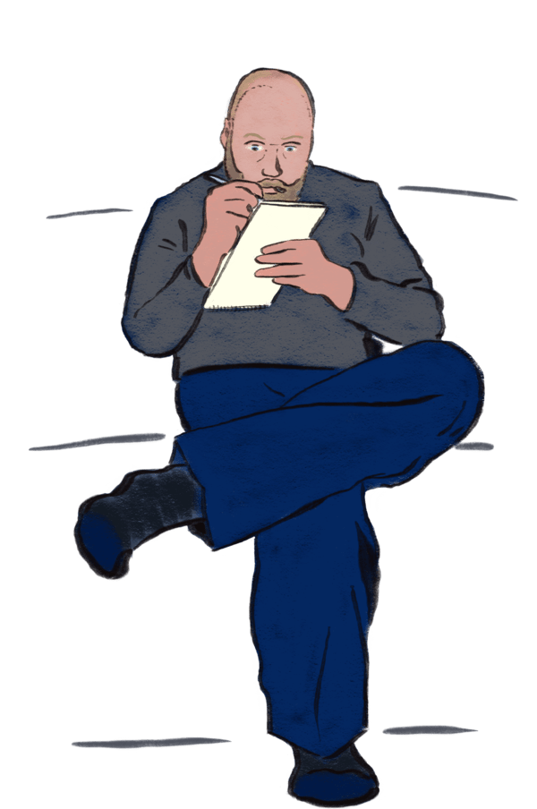
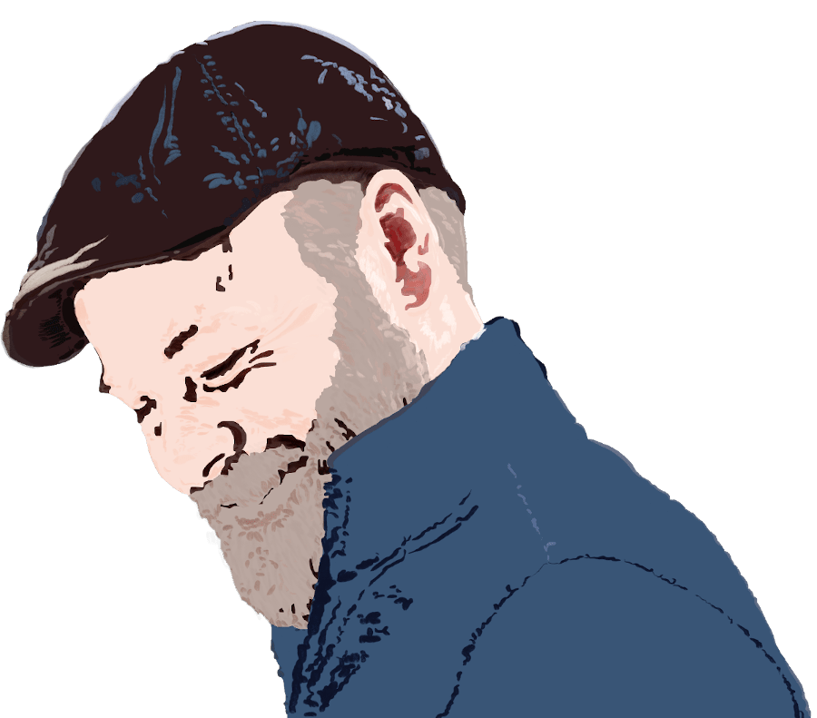

<article class="aboutContainer gridCenter gridTextPicCol">
  <article class="flexCol">
    <section>
      <h1 class="aboutText lessLeading">I'm Tavis,</h1>

      
and I love storytelling and making a difference for people. I blend my backgrounds in art, retail, and social services with technical skills in content, design, and development to help make things which help people.

      
I am passionate about service and devoted to strong content and communication. In high school, I began volunteering to write and edit for social workers representing children in dependency cases. This partnership lasted 15 years, and each time we successfully helped someone, it made every effort worthwhile.

      
My desire to improve people’s lives through communication led me to writing consultancy. I contributed technical writing and information architecture to court reports on family reunification, parenting plans, and treatment courses. At the same time, I worked as a customer-focused retail manager. Both fields inform my approach to UX. I create open, accessible design based on research and dialogue, because I have seen people benefit from it.

      
My history of working with and for diverse groups in varied situations brings value in strong cross-functional communication and practical empathy. In all my work, I rely on different viewpoints and feedback to improve interactions and outcomes for people.

      
I am curious and excited about all aspects of creating great experiences. Having trained in frontend development and user experience, I can work with people across disciplines. I want to act as a bridge between teams, combining their vocabulary, skills, and goals into a united vision.

      
I engage the big-picture, attend the small but important details, and greet all occasions as opportunities to learn. I look to make continuous improvements and to take large leaps when sensible.

      
As a society, I believe we should strive for better services. We should be inclusive. We should see content, design, and development as partners with a shared mission. We should provide users with clarity and focus while increasing their control, flexibility, and access. And we should treat those users as people deserving of compassion.

      
If you share similar thoughts, I would love to work with you towards these goals. If you have big ideas for how you want your organization to interact with people online, especially if that would help people in need, I want to talk with you about how that could happen.

      
So <a href="mailto:ctavispost@gmail.com">send me a note</a> and let's chat.

    </section>
  </article>

  
  
</article>
