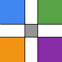
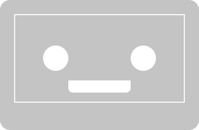
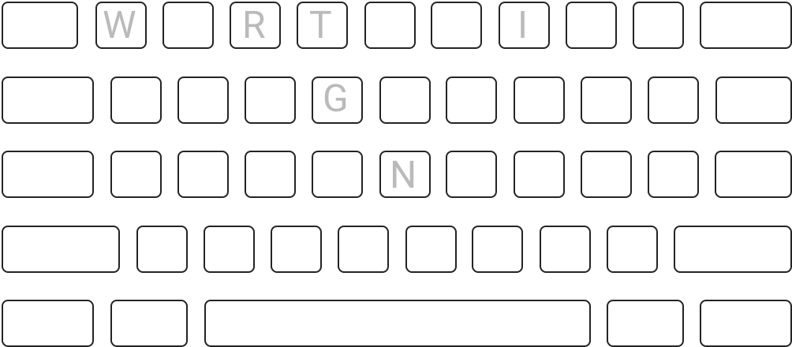
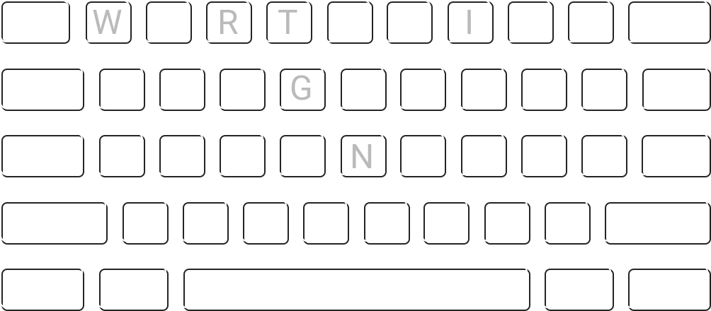

<header class="intro"> <!-- introduction -->
  

    <h1 class="introHead display">Hi!</h1>
    
I'm Tavis,&#42; a thoughtful, inclusive dev in Seattle. I work across roles with broad, practical empathy and a deep curiosity. Whether helping people directly or building an app, I create open and accessible interactions based on research, dialogue, and data.

    
&#42;like 'Travis', but without the 'r' ;)

  

</header>

<section class="studies sideMargin" id="projects"> <!-- wrapper for cards -->
  <article class="card project04">
    <a href="project04.html" class="dispBlock paddingSmB">
      <h1 class="padText leadingOne marginTopZero">find the masks</h1>
      
how, what, and where to donate gear to hospitals

      
 <!-- center images in grid and add padding to sides -->
        
        
      

    </a>
  </article>

  <article class="card project05">
    <a href="" class="dispBlock paddingSmB">
      <h1 class="padText leadingOne marginTopZero">moodpatch</h1>
      
colorful mood tracking

      
    </a>
  </article>

  <article class="card project06">
    <a href="" class="dispBlock paddingSmB">
      <h1 class="padText leadingOne marginTopZero">The Green Room</h1>
      
save your favorite albums

      
    </a>
  </article>

  <article class="card project07">
    <a href="" class="dispBlock paddingSmB">
      <h1 class="padText leadingOne marginTopZero">Andromeda TechConnect</h1>
      
bringing people and events together in tech

      
    </a>
  </article>

  <article class="card project03">
    <a href="project03.html" class="dispBlock paddingSmB">
      <h1 class="padText leadingOne marginTopZero">Dauntlez</h1>
      
self-defense workshop site

      
      
    </a>
  </article>

  <article class="card project01">
    <a href="project01.html" class="dispBlock">
      <h1 class="padText leadingOne marginTopZero">jot &</h1>
      
web storage & notebook

      
      
    </a>
  </article>

  <!--
  <article class="card project02">
    <a href="project02.html" class="dispBlock paddingSmB">
      <h1 class="padText leadingOne marginTopZero"></h1>
      

      
      
    </a>
  </article>
  -->

  <article class="card writing">
    <a href="writing.html" class="dispBlock paddingSmB">
      <h1 class="padText leadingOne marginTopZero">writing</h1>
      
      
    </a>
  </article>

  <article class="card fun">
    <a href="random.html" class="bgCover imageLink marginTopZero padBotLg padText">
      <h1 class="leadingOne marginTopZero">random fun</h1>
    </a>
  </article>

  <article class="card illustration">
    <a href="illustration.html" class="bgCover darkLink imageLink writeVert marginTopZero">
      <h1 class="padText leadingOne">illustration</h1>
    </a>
  </article>
</section> <!-- end showcase for cards -->
