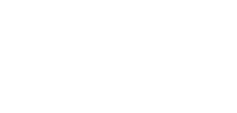
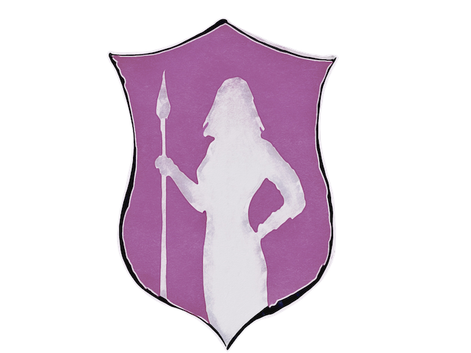
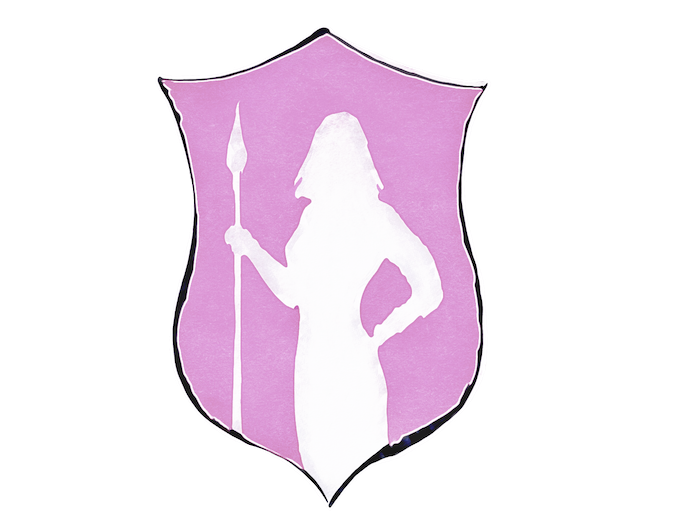
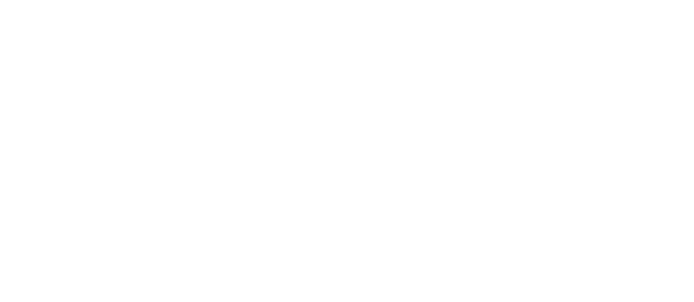
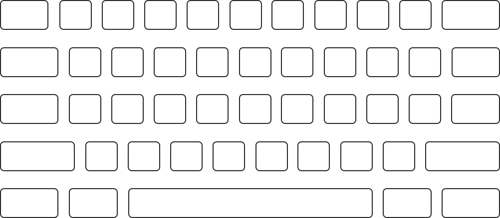

<header class="intro"> <!-- introduction -->
  

    <h1 class="introHead display">Hi!</h1>
    
I'm Tavis (without an 'r'), a thoughtful UX designer, content strategist, and illustrator from Seattle. I work across disciplines to improve experiences, clarify content, and help people.

  

</header>

<section class="studies sideMargin" id="projects"> <!-- wrapper for cards -->
  <article class="card project04">
    <a href="project04.html" class="dispBlock paddingSmB">
      <h1 class="padText leadingOne">find the masks</h1>
      
how, what, and where to donate gear to hospitals

      
 <!-- center images in grid and add padding to sides -->
        
        
      

    </a>
  </article>

  <article class="card project03">
    <a href="project03.html" class="dispBlock paddingSmB">
      <h1 class="padText leadingOne">Dauntlez</h1>
      
self-defense workshop site

      
      
    </a>
  </article>

  <article class="card project01">
    <a href="project01.html" class="dispBlock">
      <h1 class="padText leadingOne">jot &</h1>
      
web storage & notebook

      
      
    </a>
  </article>

  <!--
  <article class="card project02">
    <a href="project02.html" class="dispBlock paddingSmB">
      <h1 class="padText leadingOne">bus_hop</h1>
      
mobile transit app

      
      
    </a>
  </article>
  -->

  <article class="card writing">
    <a href="writing.html" class="dispBlock paddingSmB">
      <h1 class="padText">writing</h1>
      
      
    </a>
  </article>

  <article class="card fun">
    <a href="random.html" class="bgCover imageLink leadingOne">
      <h1>random fun</h1>
    </a>
  </article>

  <article class="card illustration">
    <a href="illustration.html" class="bgCover darkLink imageLink writeVert">
      <h1>illustration</h1>
    </a>
  </article>
</section> <!-- end showcase for cards -->
