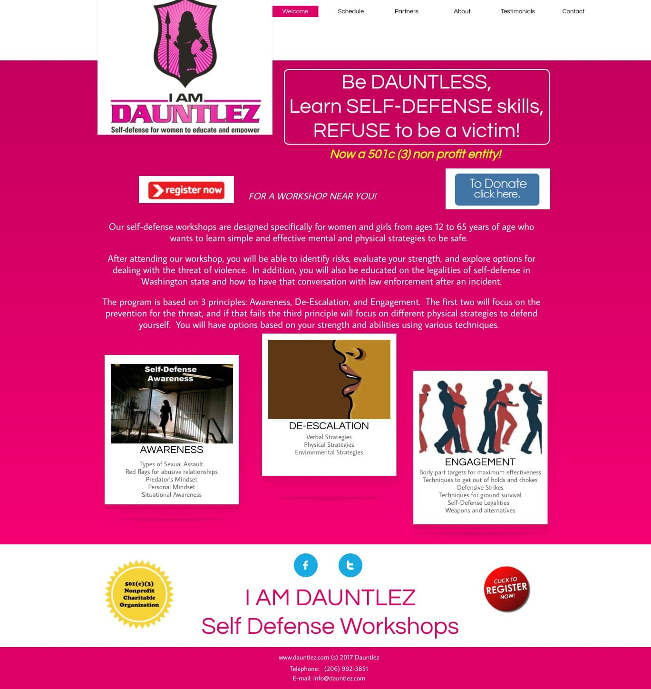
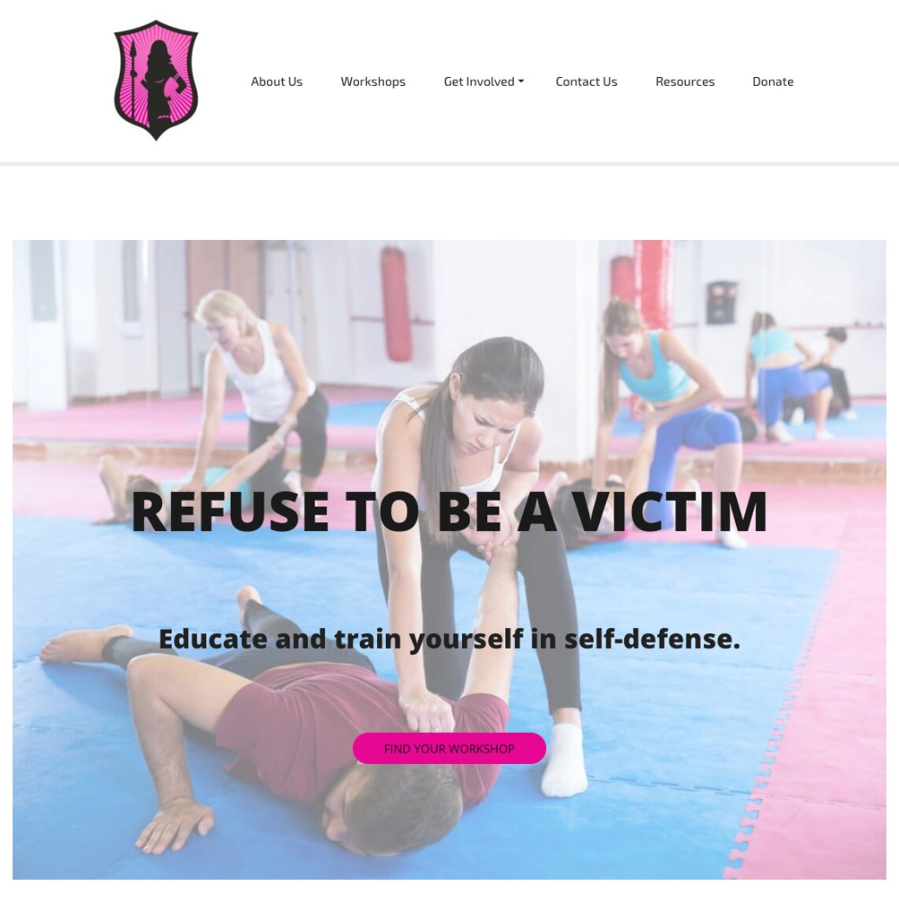
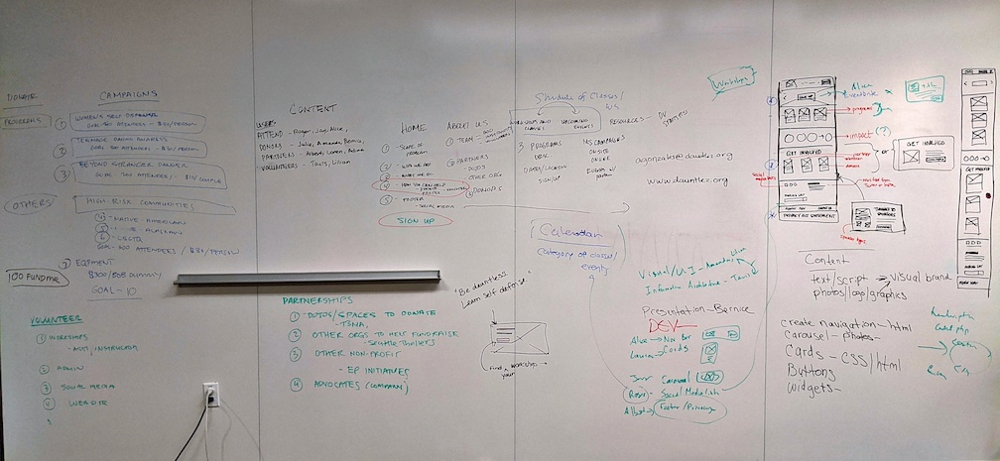

<article class="projContainer" markdown="1">

<header class="flexRow flexCenter">
<h1 class="centerGrid" markdown="1">[Dauntlez.org](https://dauntlez.org)</h1>

</header>

Dauntlez is a nonprofit organization dedicated to ending domestic violence and abuse by educating and empowering women, teens, and parents. They run workshops teaching physical defense, awareness, and de-escalation to women, teens, and parents. I launched Dautnlez.org with a team of 10 other people at a 6 hour hackathon.

Working from discussions with the product owner and information from an earlier site, Dauntlez.com, we collaborated on a completely new design. I created and refined content, information architecture, and UI artifacts which I deployed to new pages on WordPress. I also championed accessibility and a focus on users' goals.

At the end of the day, we had a site which let people sign up for classes, donate, and learn the 'what' and 'why' of Dauntlez. Here's a quick <a href="https://democracylab.ghost.io/user-experience-design-volunteers-unite-with-dauntlez-to-help-defend-women-and-teens/">article</a> about our project.

<section markdown="1">

Role: Content strategy & design

Working with the product owner and 9 other volunteers, I designed and deployed Dauntlez.org. I created its information architecture and content based on essential user needs and the organization's goals.

<h3 class="speechOrPrintOnly">Role: Content strategy & design</h3> <!-- accessible version of above -->

Working with the product owner and 9 other volunteers, I designed and deployed Dauntlez.org. I created its information architecture and content based on essential user needs and the organization's goals.
{:.speechOrPrintOnly}

Deliverables

content strategy, content, user types, user stories, user flows, wireframes, site-map, deployed site

<h3 class="speechOrPrintOnly">Deliverables</h3> <!-- accessible version of above -->

content strategy, content, user types, user stories, user flows, wireframes, site-map, deployed site
{:.speechOrPrintOnly}

Tools

WordPress, CSS, Google Docs, Excel, Trello, markers, paper, whiteboard

<h3 class="speechOrPrintOnly">Tools</h3> <!-- accessible version of above -->

WordPress, CSS, Google Docs, Excel, Trello, markers, paper, whiteboard
{:.speechOrPrintOnly}
</section>

<section markdown="1">
<h2 class="centerGrid medBreak" markdown="1">Problem</h2>

old dauntlez.com main page

People want to learn about Dauntlez’s classes and mission, but the old .com site is difficult to use.

<h2 class="centerGrid medBreak" markdown="1">Solution</h2>

new dauntlez.org landing hero

A new .org site communicates Dauntlez’s mission with a clear hero-section and call to action. The flow of information is simpler and intuitive. Text and images have been made more accessible. Each section has a purpose.

</section>

<section markdown="1">
<h2 class="centerGrid medBreak" markdown="1">The process</h2>

With the time constraints of a hackathon, we based our assumptions and discovery on conversations with Adina, the product owner, and information on her old website. Our discussion helped me to form three user types:
- people who might take a class (our primary audience)
- potential volunteers
- possible donors

We worked up user stories for these people. Based on assumed user goals, I lead a group in sketching out the the information architecture strategy, including a header, footer, and site map. We converged on our basic design in collaboartion with developers who were working to set up the site structure on WordPress and another group of designers that had begun wireframing iterations of the landing page.

From there, I focused on maintaining consistency and accessibility across content. We worked together to ensure users knew which classes were available, when, and who they were for. At the end of the day, we attained our goal of having functioning main and workshop-selection pages in a structure that could be added to later.
</section>

<section markdown="1">
<h2 class="centerGrid medBreak" markdown="1">What's next for Dauntlez.org?</h2>

The site needs to offer utility to potential volunteers and donors. Right now, it lacks information geared toward them, and there isn't a direct way to offer to volunteer.

Another pass should be made to make the site inclusive. In particular, images showing information should have text or graphs added separately to make them accessible.

Once essential elements are seen to, Dauntlez could use some research to better serve its community. Areas of opportunity likely include UI and social media outreach. It would help to have a story interwoven throughout the site, offering a more compelling and immersive experience.

Possible future additions might include videos, online courses, greater detail about what is taught in each workshop, and stronger fundraising copy.
</section>

<!--
<section markdown="1">
<h2>What I learned</h2>

</section>
-->

</article>
