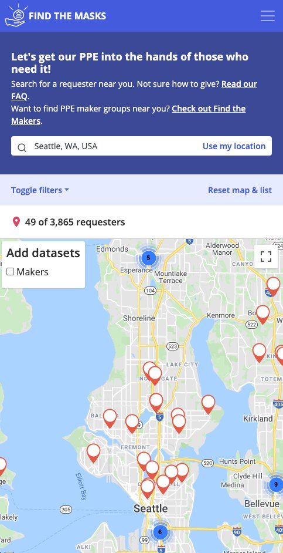

<article class="projContainer" markdown="1">

<header class="flexCenter flexCol">

<h1 class="lockupBreakVert" markdown="1">[findthemasks](https://findthemasks.com)</h1>
</header>

[findthemasks.com](https://findthemasks.com) shares ways to donate protective equipment to hospitals. The spread of COVID-19 caused shortages of masks, gloves, and other items healthcare workers need. By curating information from thousands of hospitals across the US, Canada, and Europe, findthemasks helped people find what, where, and how to donate in ways that helped protect us all.

<section markdown="1">

 <!-- for accessibility, details elements are set to not show if a screen reader or printer is being used -->

Role: UX, information architecture, CSS

Working with the product owner and devops lead, I designed the HTML and CSS information architecture and styling for the site launch, and assisted with subsequent testing and improvements.

<h3 class="speechOrPrintOnly">Role: UX, information architecture, CSS</h3> <!-- accessible version of above for screen readers and printing -->

Working with the product owner and devops lead, I designed the HTML and CSS information architecture and styling for the site launch, and assisted with subsequent testing and improvements.
{:.speechOrPrintOnly}

Deliverables

HTML, CSS, wireframes, sketches, site prototypes

<h3 class="speechOrPrintOnly">Deliverables</h3> <!-- accessible version of above -->

HTML, CSS, wireframes, sketches
{:.speechOrPrintOnly}

Tools

GitHub, HTML, CSS, Bootstrap, Google Docs, Slack, Figma, markers, whiteboard

<h3 class="speechOrPrintOnly">Tools</h3> <!-- accessible version of above -->

GitHub, HTML, CSS, Bootstrap, Google Docs, Slack, Figma, markers, whiteboard
{:.speechOrPrintOnly}
</section>

<section class="medBreak" markdown="1">
<h2 class="centerGrid" markdown="1">Problem</h2>

People had personal protective equipment (PPE) and were willing to donate it, but they didn't know where or what to give. Hospitals were in desperate need of PPE, and knew what they needed, but were overburdened and didn't have a good way of getting that information out.
</section>

<section class="medBreak" markdown="1">
<h2 class="centerGrid" markdown="1">Solution</h2>

mobile site

findthemasks shows:
- donation locations
- what they need
- how to give

Hospitals could add or remove their information through a linked form. After moderators approved it, the index automatically updated. The resulting list is searchable by map and filters.
</section>

<section class="medBreak" markdown="1">
<h2 class="centerGrid" markdown="1">Approach</h2>

I came in on day two. Within a set layout, I was asked to clean up and style the markup. I removed inline styles, created a new stylesheet, made the markup semantic, and refactored the page structure to be accessible and responsive.

I assisted with branding and design strategy in conversation and with sketches. My proposal for a bottom nav bar, based on research from Apple and Google, eventually influenced the use of a language and country selection bar at the bottom of the screen.

My most lasting contribution to the project was simple, but integral. I placed state, city, and hospital names in descending h-tags (h2, h3, and h4 respectively). This made the HTML more meaningful and was integral to automating list entries. Much has changed about findthemasks since then, but this remains a key piece.
</section>

<section class="medBreak" markdown="1">
<h2 class="centerGrid" markdown="1">Impact</h2>

My contributions helped to launch findthemasks.com and set it up to scale. In the first three days, we listed 250 hospitals in the US and saw 20,000 unique visitors per day. Now, the site lists thousands of hospitals across multiple continents.
</section>

<section class="medBreak" markdown="1">
<h2 class="centerGrid">What I learned</h2>

At launch, we listed only 50 donation sites. As locations were added at a high rate, anticipating issues of scale was important. The HTML structure I chose worked well here. But the styling could have done more.

findthemasks operates on a strong assumption that users arrive already motivated, and so it attempts to be as simple as possible. I had tried to stick to this theme using a single font family. Even with different font sizes and opacity to indicate hierarchy, once the donation site list grew over a thousand, it needed to help users quickly differentiate cities and hospitals when scrolling.

User feedback brought this to our attention a week after launch. If I had considered this opportunity at the beginning, I would have used an easy to read, serif font for cities and states, while the hospitals would have been sans serif like the rest of the page.

In retrospect, it's obvious that more content can make the same-styled page seem more complex and harder to read. This is something I will carry with me when I consider how to make products robust.
</section>

</article>
