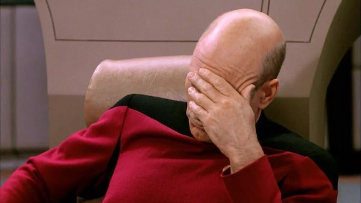

<article class="centerGrid aboutContainer contMaxwidth btCont">
  <header class="centerGrid trekTitle">
    <h1 class="txtScale3">BARTREK</h1>
  </header>

  

  <section class="aboutText trekIntro respTxtThirty">
    
Space ale, the finest of beers. These are the indulgences of the barship Bingerprize. Its unending mission: to explore strange new brews, to seek out new stills and new concoctions, to boldly drink where no one has drunk before.

  </section>

  <h3 class="trekSubHd">John Luke Drunkard –</h3>

  

  <section class="aboutText trekStory">
    
Captain's blog,

    
bardate some-day-ending-in-y:

    
The novel barona virus outbreak continues aboard ship, and we find ourselves unsocially distancing to avoid contamination. Commander Spiker remains useless, even more so now, as he has no one to dose but himself.

    
All bars, taverns, and pubs have been closed. Much to the crew's disappointment, even the orgy dome of Bend Forward is sealed shut.

    
As morale falters, and with only a skeleton crew to run the ship, we have been tasked with meeting a Klingbong delegation who claim their native strain of ganja can cure the illness. Though I have my doubts, I can only hope they are right.

  </section>

  <section class="conditionalFlexCol palm flexAlignItemsEnd"> <!-- becomes a flex column w. end justification at screen width of 640px or higher -->
    
    
"Computer, end simulation."

  </section>
</article>

<article class="medBreak aboutContainer contMaxwidth">
  <h2 class="leadingOne">On a lovely day,</h2>
  
The trees are dancing as they defrock in the wind,

  
And I will leaf-fight anyone

  
Who denies fall is the best of seasons.

</article>

<article class="medBreak aboutContainer contMaxwidth">
  <h2 class="leadingOne">Resolved:</h2>

  
Henceforth, 'blandishment' should mean 'becoming bland, being made commonplace or unremarkable, or a state of mundanity'. It should in no way be associated with alluring, coaxing, or persuasion except in fantasy novels and renaissance fairs.

  
–This is in line with its origin, where the Latin word meant 'mild' as well as 'flattering'.–

  <figure class="smBreak" style="--aspect-ratio: 16/9;">
    <iframe title="Ten_Commandments_clip" class="respIframe" width="560"
      height="315" loading="lazy" src="https://www.youtube.com/embed/3bQnxlHZsjY" frameborder="0" allow="accelerometer; autoplay; encrypted-media; gyroscope; picture-in-picture" allowfullscreen></iframe> <!-- a video clip from 'The Ten Commandments': "So let it be written, so let it be done." -->
  </figure>
</article>

<article class="medBreak aboutContainer contMaxwidth">
  <h2 class="leadingOne">Shortly</h2>
  
after breakfast one morning, my little boy turned to me and declared, "Dadda, I'm hungry, and I don't want fruit." We had apples, cherries, raspberries, and blueberries at hand.

  
"If you say you're hungry, but you won't eat fruit you like, you aren't hungry," I informed him. "We've had this conversation before."

  
"But not today," he replied.

</article>

<article class="medBreak aboutContainer contMaxwidth">
  <h2 class="leadingOne">We are quick</h2>
  
to judge substance dependence but idolize the adrenaline rush of dangerous and pointless accomplishments.

  
Climbing Everest is a bit like drinking heroic amounts of whiskey:

  <ul>
    <li>it's dangerous</li>
    <li>not everyone can do it</li>
    <li>it's sort of impressive</li>
    <li>and it's kind of stupid</li>
  </ul>
</article>

<article class="medBreak aboutContainer contMaxwidth">
  <h2 class="leadingOne">Sometimes,</h2>
  
when I see claims of 'character assassination',

  
I think to myself,

  
"I certainly hope so."

</article>
