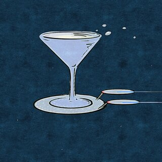
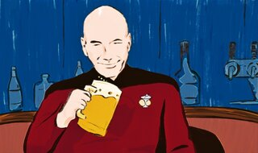

<article class="projContainer aboutContainer" markdown="1">
<header class="centerGrid">
<h1 class="trekTitle flexRow txtScale3">BARTREK</h1>
</header>
<section class="conditionalFlexCol medBreak" markdown="1">

Space ale, the finest of beers. These are the indulgences of the barship Bingerprize. Its unending mission: to explore strange new brews, to seek out new stills and new concoctions, to boldly drink where no one has drunk before.
{:.aboutText .smBreak .txtScale1}
</section>

<article class="medBreak" markdown="1">
<h2 class="trekSub">John Luke Drunkard–</h2>

<section class="aboutText" markdown="1">
<h3>Captain's blog, bardate some-day-ending-in-y:</h3>

The novel barona virus outbreak continues aboard ship, and we find ourselves unsocially distancing to avoid contamination. Commander Spiker remains useless, even more so now, as he has no one to dose but himself.

All bars, taverns, and pubs have been closed. Much to the crew's disappointment, even the orgy dome of Bend Forward is sealed shut.

As morale falters, and with only a skeleton crew to run the ship, we have been tasked with meeting a Klingbong delegation who claim their native strain of ganja can cure the illness. Though I have my doubts, I can only hope they are right.
</section>

</article>
</article>
