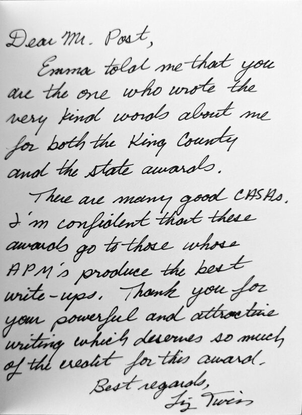
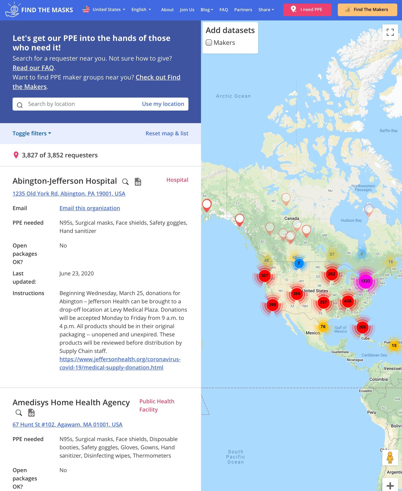
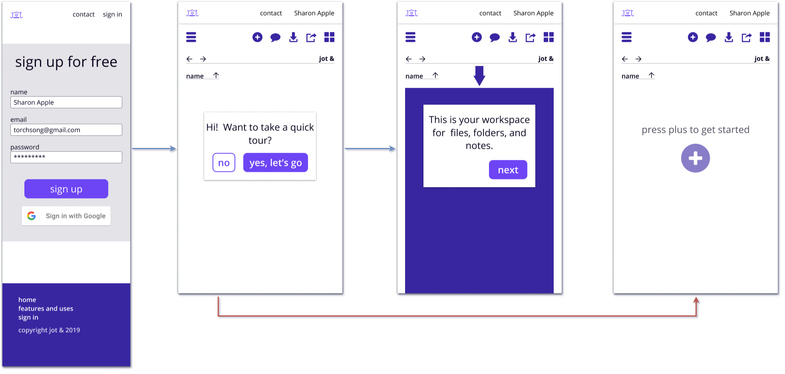
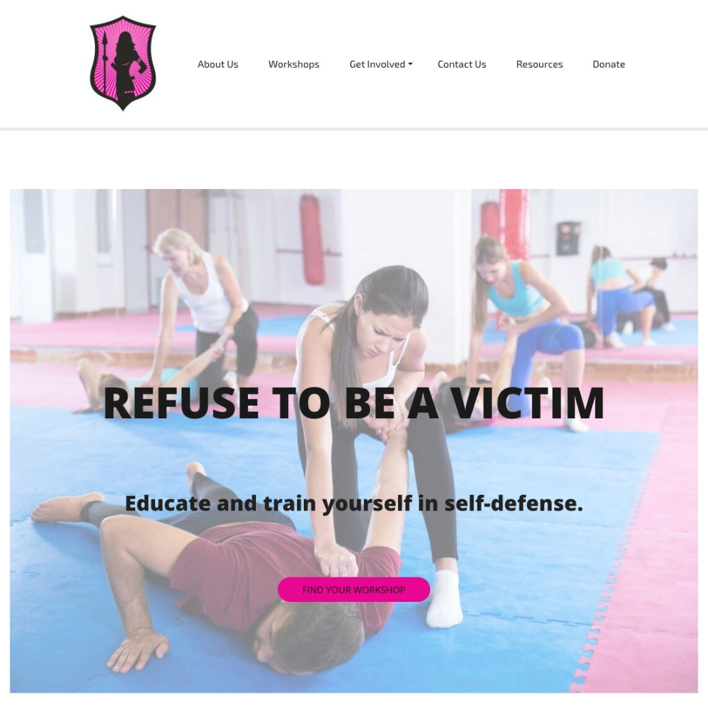
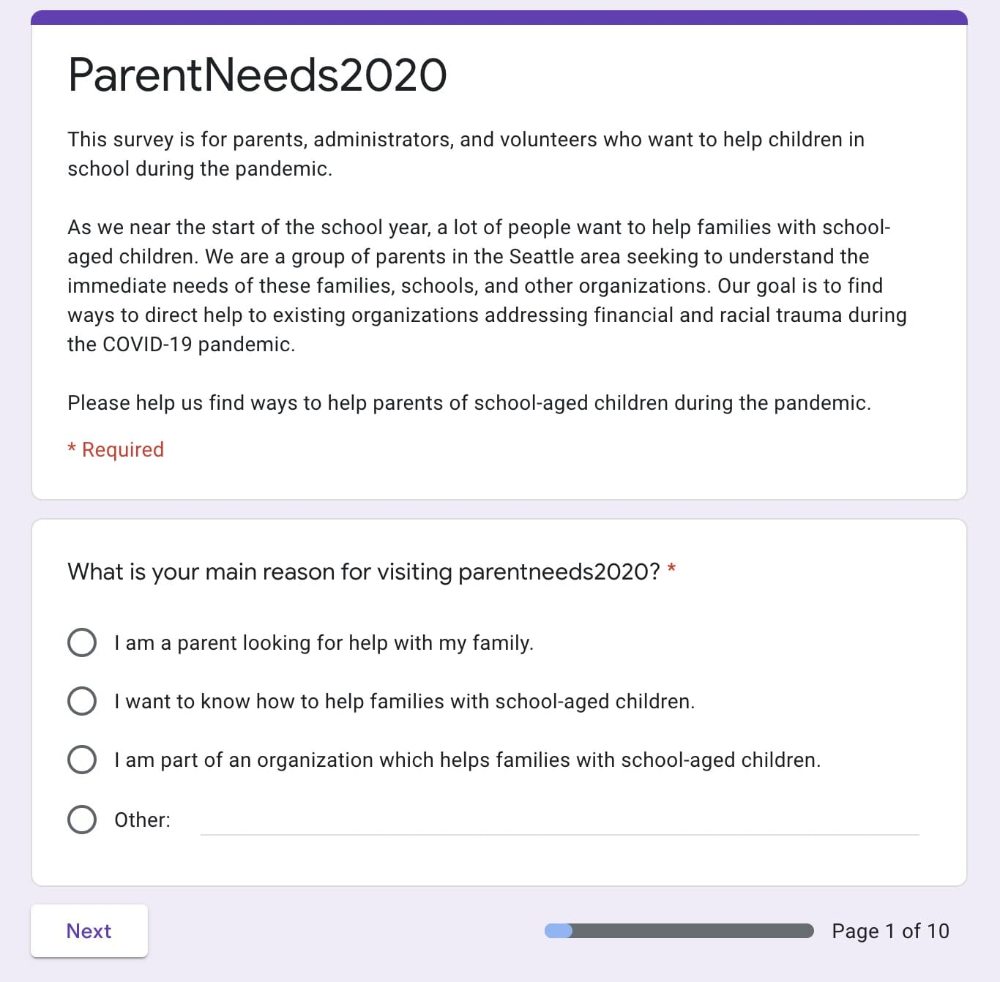

<article class="aboutContainer contMaxwidth grid centerGrid">
  <article class="centerGrid">
    
I am passionate about service devoted to strong content and communication.

    
As a society, I believe we should strive for better and more inclusive services. We should see content, design, and development as partners with a shared mission. We should provide users with clarity and focus while increasing their control, flexibility, and access. And we should treat those users as people deserving of meaningful compassion.

    
As you'll see below, I set out to achieve this in all my writing.

    
If you share similar feelings, I would love to work with you towards these goals. <a href="mailto:ctavispost@gmail.com">Send me a note</a> and let's connect!

  </article>

  <article class="medBreak centerGrid">
    <h3>What people say</h3>

    

      <section class="grid centerGrid">
        
      </section>

      <section>
        <blockquote>
          
Thank you for your powerful and attractive writing.

        </blockquote>

        <!--
        <blockquote>
          
Tavis' editing and narrative skills are incisive and fascile.

        </blockquote>

        <blockquote>
          
Your help with my resume unblocked my job search!

        </blockquote>
        <!-- add quotes from Emma and Robin with small photographs -->
      </section>
    

  </article>

  <article class="medBreak centerGrid">
    <h3>Packaging and showing information</h3>
    

      <section>
        
Findthemasks helps people with extra personal protective equipment (PPE) find local health organizations who need it.

        <ul>
          <li><a href="docs/ftmHome.pdf">Home</a></li>
          <li><a href="docs/ftmFaq.pdf">FAQ</a></li>
          <li><a href="docs/ftmAbout.pdf">About</a></li>
        </ul>

        
role: UX Designer 

        
deliverables: information architecture, writing, editing, iconography, testing

        
tools: Github, Slack, HTML, CSS, Bootstrap, Firebase, Google Docs, Google Analytics, Illustrator, whiteboard and markers

      </section>

      <section class="grid centerGrid">
        
      </section>
    

  </article>

  <article class="grid centerGrid medBreak">
    <h3>Onboarding</h3>

    

      <section class="grid centerGrid">
        
      </section>

      <section>
        
New users sign up and are given a walkthrough of jot &amp;'s mobile app. See all the onboarding screens <a href="docs/jotOnboard.pdf">here</a>.

        
role: UX Designer

        
deliverables: interaction design, writing, user testing

        
tools: Figma, pen and paper, interviews and user tests

      </section>
    

  </article>

  <article class="grid centergrid medBreak">
    <h3>Crafting landing pages</h3>

    

      <section class="grid centerGrid gridSelfJustCenter">
        
      </section>

      <section>
        
Drawing people in and showing what is offered:

        <ul>
          <li>jot &amp;'s <a href="docs/jotLanding.pdf">landing page</a></li>
          <li>Dauntlez.org's <a href="docs/dauntlezLand.pdf">homepage</a></li>
        </ul>

        <section>
          
role: UX Designer

          
deliverables: research, writing, illustration, iconography, layout, information architecture, content strategy

          
tools: Figma, Trello, Google Docs suite, Excel, Illustrator, WordPress, Autodesk Sketchbook, HTML, CSS, Zoom, pen and paper, whiteboard and markers

        </section>
      </section>
    

  </article>

  <article class="grid centerGrid medBreak">
    <h3>Surveys</h3>

    

      <section>
        
Gathering information to define problems and solutions by asking the right questions:

        <ul>
          <li><a href="docs/pnSurvey.pdf">ParentNeeds2020</a></li>
          <li><a href="docs/cloudSurvey.pdf">jot &amp;</a></li>
        </ul>

        <section class="flexy flexCol">
          
role: UX Designer

          
deliverables: survey, results, interviews, analysis

          
tools: Google forms, Reddit, Facebook, email, Slack, Zoom

        </section>
      </section>

      <section class="grid centerGrid">
        
      </section>
    

  </article>

  <article class="centerGrid medBreak">
    <h3>Reports and analysis</h3>

    <section class="grid gridGapOne condGridOneTwo">
      <section>
        
      </section>

      <section>
        
Recommendations and plans to solve problems based on evidence:

        <ul>
          <li>
            <a href="https://docs.google.com/document/d/1IHJvq1w5f7r7YySX0X0GNedk00ECIwRaf9I908ixWHM/edit?usp=sharing">jot &: cloud survey report</a>
          </li>

          <li>
            <a href="https://docs.google.com/document/d/1HgViwIEgB70t-5nhOErMvRskMoC-aQfqty4rWqXPpx4/edit?usp=sharing">jot &: competitive analysis</a>
          </li>
        </ul>

        <section  class="flexy flexCol">
          
role: UX Designer

          
deliverables: finished analysis and reports

          
tools: Google Docs suite, Microsoft Office, interviews

        </section>
      </section>
    </section>
  </article>
</article>
