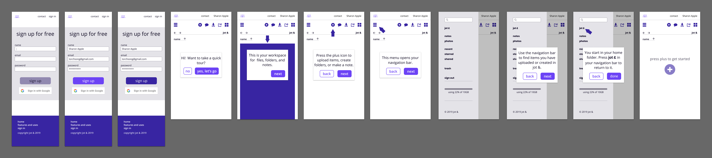

<article>
  <h1>Writing in UX and content</h1>

  
I am passionate about service and devoted to strong content and communication.

  
As a society, I believe we should strive for better services. We should be inclusive. We should see content, design, and development as partners with a shared mission. We should provide users with clarity and focus while increasing their control, flexibility, and access. And we should treat those users as people deserving of compassion.

  
If you share similar thoughts, I would love to work with you towards these goals. <a href="mailto:ctavispost@gmail.com">Send me a note.</a>

</article>

<article>
  <h1>Examples</h1>
  <section class="conditionalFlexRow">
    <h2>Conveying and packaging information</h2>

    
FindTheMasks powers over a dozen sites with its information and maps, helping people with extra personal protective gear donate to local hospitals.

    
    <a href="docs/ftmHome.pdf">Home</a>
    <a href="docs/ftmFaq.pdf">FAQ</a>
    <a href="docs/ftmAbout.pdf">About</a>

    
role: UX Designer 

    
contributions: information architecture, writing, editing, iconography, testing

    
tools: Github, Slack, HTML, CSS, Bootstrap, Firebase, Google Docs, Google Analytics, Illustrator, whiteboard and markers

  </section>

  <section class="conditionalFlexRow">
    <h2>Onboarding</h2>

    
New users sign up and are given a walkthrough of jot &.

    
    

    
role: UX Designer

    
contributions: interaction design, writing, user testing

    
tools: Figma, pen and paper, interviews and user tests

  </section>

  <section class="conditionalFlexRow">
    <h2>Landing pages</h2>

    
Showing the services offered at jot & and Dauntlez.org.

    
    
    
    

    
role: UX Designer

    
contributions: research, writing, illustration, iconography, layout, information architecture 

    
tools: Figma, Trello, Google Docs suite, Excel, Illustrator, WordPress, Autodesk Sketchbook, HTML, CSS, Zoom, pen and paper, whiteboard and markers 

  </section>

  <section class="conditionalFlexRow">
    <h2>Surveys</h2>

    
Gathering information to define problems and solutions.

    
    
    
    

    
role: UX Designer

    
contributions: 

    
tools: 

  </section>

  <section class="conditionalFlexRow">
    <h2>Reports and analysis</h2>

    
Reccommendations based upon evidence.

    
    
    
    

    
role: UX Designer

    
contributions: 

    
tools: 

  </section>
