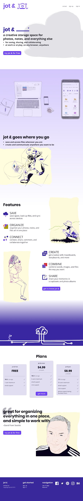

<article class="aboutContainer contMaxwidth centerGrid">
  <article>
    
I am passionate about service devoted to strong content and communication.

    
As a society, I believe we should strive for better and more inclusive services. We should see content, design, and development as partners with a shared mission. We should provide users with clarity and focus while increasing their control, flexibility, and access. And we should treat those users as people deserving of meaningful compassion.

    
If you share similar thoughts, I would love to work with you towards these goals. <a href="mailto:ctavispost@gmail.com">Send me a note</a> and let's connect!

  </article>

  <article class="medBreak">
    <section class="grid">
      <h3>Showing and packaging information</h3>

      <section class="centerGrid gridGapOne">
        
FindTheMasks powers over a dozen sites with its information and maps, helping people with extra personal protective gear donate to local hospitals.

        
      </section>

      <section class="flex flexCol">
        <a href="docs/ftmHome.pdf">Home</a>
        <a href="docs/ftmFaq.pdf">FAQ</a>
        <a href="docs/ftmAbout.pdf">About</a>
      </section>

      <section class="flex flexCol">
        
role: UX Designer 

        
deliverables: information architecture, writing, editing, iconography, testing

        
tools: Github, Slack, HTML, CSS, Bootstrap, Firebase, Google Docs, Google Analytics, Illustrator, whiteboard and markers

      </section>
    </section>

    <section class="grid medBreak">
      <h3>Onboarding</h3>

      <section class="centerGrid gridGapOne">
        
New users sign up and are given a walkthrough of jot &amp;.

        
      </section>

      
<a href="docs/jotOnboard.pdf">jot &amp; pdf</a>

      <section class="flex flexCol">
        
role: UX Designer

        
deliverables: interaction design, writing, user testing

        
tools: Figma, pen and paper, interviews and user tests

      </section>
    </section>

    <section class="grid medBreak">
      <h3>Landing pages</h3>

      <section class="centerGrid gridGapOne">
        
Showing the services offered at jot &amp; and Dauntlez.org.

        <section class="condGridRow gridGapOne">
          
          
        </section>
      </section>

      <section class="flex flexCol">
        
<a href="docs/jotLanding.pdf">jot &amp; pdf</a>

        
<a href="docs/dauntlezLand.pdf">Dauntlez pdf</a>

      </section>

      <section>
        
role: UX Designer

        
deliverables: research, writing, illustration, iconography, layout, information architecture, content strategy

        
tools: Figma, Trello, Google Docs suite, Excel, Illustrator, WordPress, Autodesk Sketchbook, HTML, CSS, Zoom, pen and paper, whiteboard and markers

      </section>
    </section>

    <section class="grid medBreak">
      <h3>Surveys</h3>

      <section class="centerGrid gridGapOne">
        
Gathering information to define problems and solutions.

        
      </section>
      
      <a href="docs/pnSurvey.pdf">ParentNeeds2020</a>
      

      <section class="flex flexCol">
        
role: UX Designer

        
deliverables: survey

        
tools: Google forms, Reddit, Facebook, email, Slack, Zoom

      </section>
    </section>

<!--
  <section class="centerGrid medBreak">
    <h3>Reports and analysis</h3>
    <section class="grid gridGapOne">
      
Reccommendations based upon evidence.

      
      
      
      
    </section>

    <section  class="flex flexCol">
      
role: UX Designer

      
deliverables: 

      
tools: 

    </section>
    </section>
-->
  </article>
</article>
